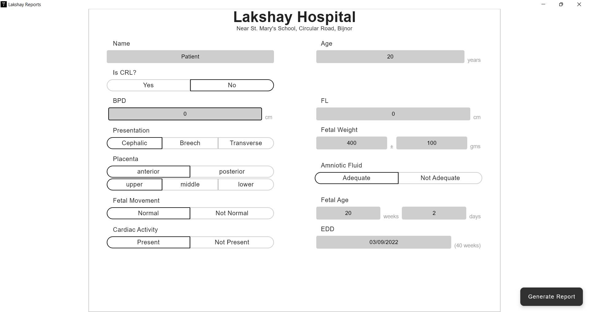
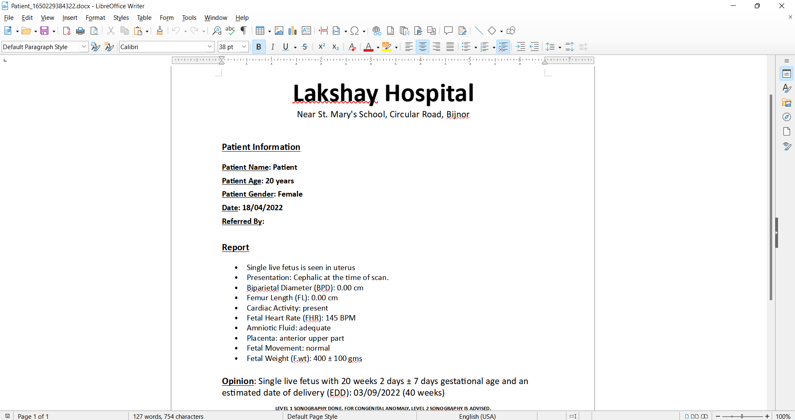

 
<h2 align="center"><b>Lakshay Reports</b></h2>
<h4 align="center">A Desktop app to automate typing an Ultrasound Reports</h4>

<a href="#screenshots">Screenshots</a> &bull; <a href="#description">Description</a> &bull; <a href="#features">Features</a> &bull; <a href="#libraries">Libraries Used</a>

## Screenshots

## Description
Lakshay Reports generates word documents according to the report templates with the provided information. 
It uses Apache POI for report generation and Jetpack Compose for the UI.

### Features
* Automatic report generation
* Keeps record of reports generated for the past month in Documents/Reports sorted by date.
* Deletes older reports
* Uses clean architecture

### Libraries
* [Compose Desktop](https://www.jetbrains.com/lp/compose-desktop/) - UI
* [Apache POI](https://poi.apache.org/) - Word document generation

